# Database Project - Stage A
## System Name: MediFlow HMS (Hospital Management System)

**Student 1 Name:** Asher Abensour  
**Student 2 Name:** Shimon Khakshour

---

## Table of Contents
1. [Introduction](#introduction)
2. [UI Characterization](#ui-characterization)
3. [Database Design (ERD & DSD)](#database-design)
4. [Data Population Methods](#data-population-methods)
5. [Backup and Recovery](#backup-and-recovery)

---

## Introduction
**MediFlow HMS** is a comprehensive Hospital Management System designed to streamline medical and administrative workflows. The system follows a **Top-Down** approach, where business requirements and user interface designs dictated the underlying database structure. 

**Core Functionality:**
* **Patient Management:** Comprehensive tracking of registration, personal details, and medical history.
* **Staff Coordination:** Managing medical personnel roles and department assignments.
* **Inpatient Logistics:** Real-time tracking of room and bed occupancy across different hospital wards.
* **Clinical Records:** Documenting visits, diagnoses, and medical prescriptions.
* **Financial Management:** Generating invoices and managing billing for medical services.

---

## UI Characterization
The system interface was meticulously characterized using **Google AI Studio**. Each screen was designed to represent a core functional module of the hospital, ensuring that the database supports all necessary data entry and retrieval points.

**Characterization Link:** [https://ai.studio/apps/b3ae05ac-49e8-4a7c-ac85-7703f4a17ebc](https://ai.studio/apps/b3ae05ac-49e8-4a7c-ac85-7703f4a17ebc)

### System Interface Detailed Mockups:

1. **Patient Registration:** Used for onboarding new patients and maintaining personal contact information.  
   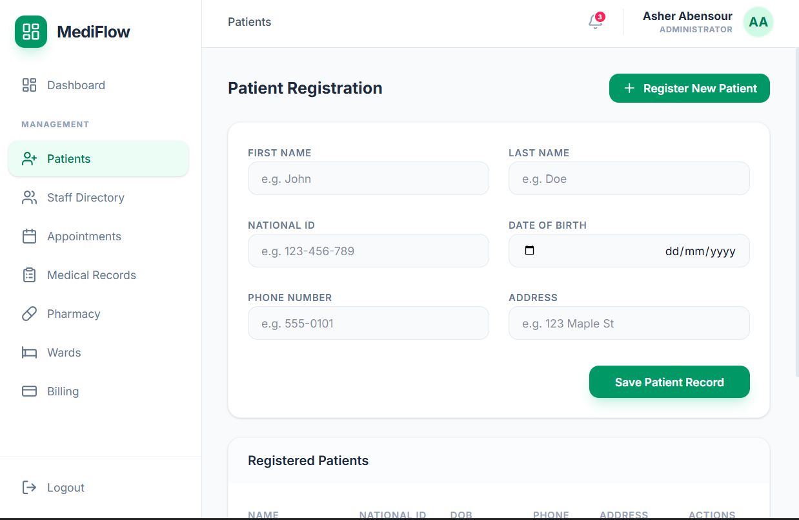

2. **Staff Directory:** A central hub for managing doctors, nurses, and administrative staff, including their specializations and status.  
   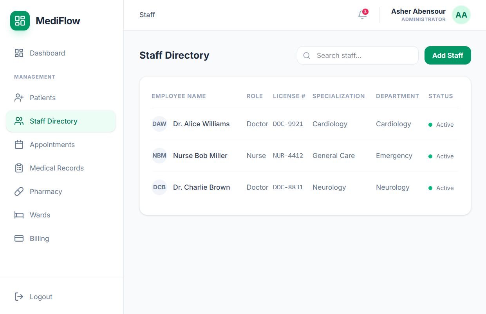

3. **Appointment & Room Scheduling:** Manages the scheduling of patient consultations and assigns them to specific doctors and rooms.  
   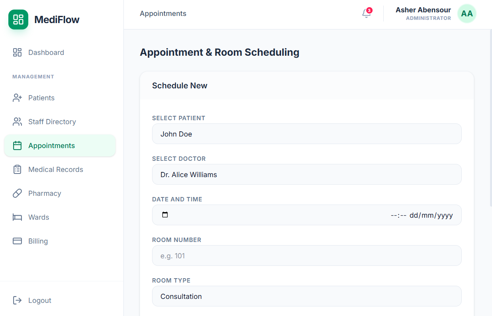

4. **Visit & Medical Records:** Facilitates the recording of visit IDs, diagnoses, and detailed clinical notes for each patient encounter.  
   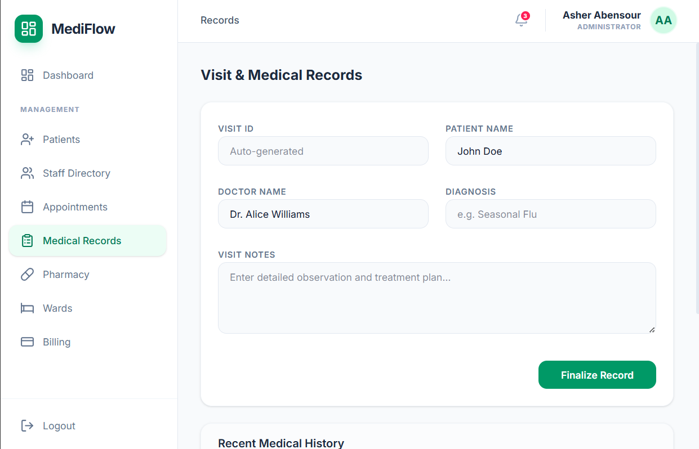

5. **Pharmacy & Prescriptions:** Handles the issuance of medical prescriptions, including medication names, dosages, and instructions.  
   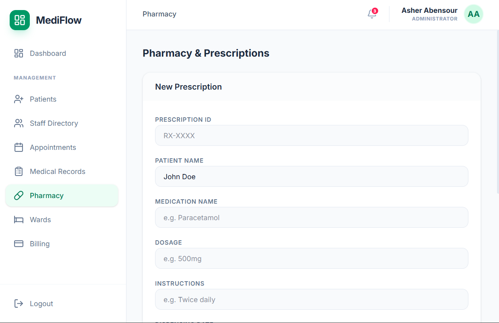

6. **Inpatient Ward Management:** Provides a real-time overview of ward capacity (ICU, Maternity, etc.) and current bed occupancy.  
   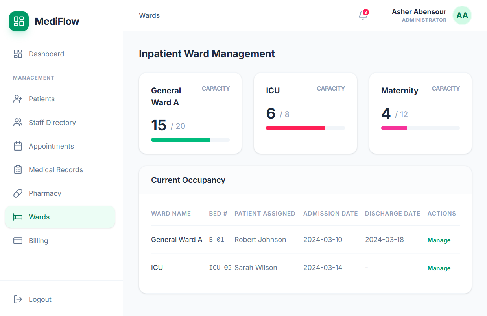

7. **Billing & Invoices:** Manages the financial aspect, generating invoices based on patient services and tracking payment status.  
   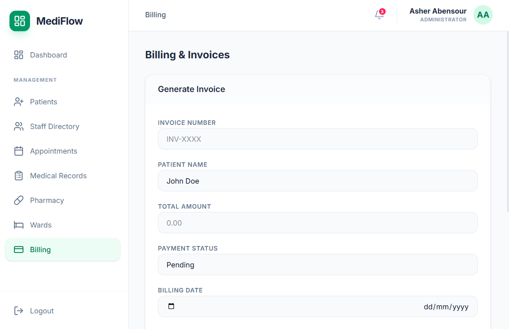

---

## Database Design
The database was designed using **ERD Plus** and is normalized to **3NF** to ensure data integrity.

### Entities and Attributes:
The system consists of 11 primary entities:
* **Patients**: `Patient_ID`, `First_Name`, `Last_Name`, `Date_Of_Birth`, `Phone_Number`, and `Address`.
* **Departments**: `Department_ID` and `Department_Name`.
* **Staff**: `Employee_ID`, `First_Name`, `Last_Name`, and `Role`.
* **Rooms & Beds**: `Room_ID` and `Bed_ID`.
* **Medical Events**: `Appointments`, `Visits`, and `Inpatient_Admissions`.
* **Pharmacy & Billing**: `Medications`, `Prescriptions`, and `Invoices`.

### Diagrams:
#### ERD Diagram (Conceptual)
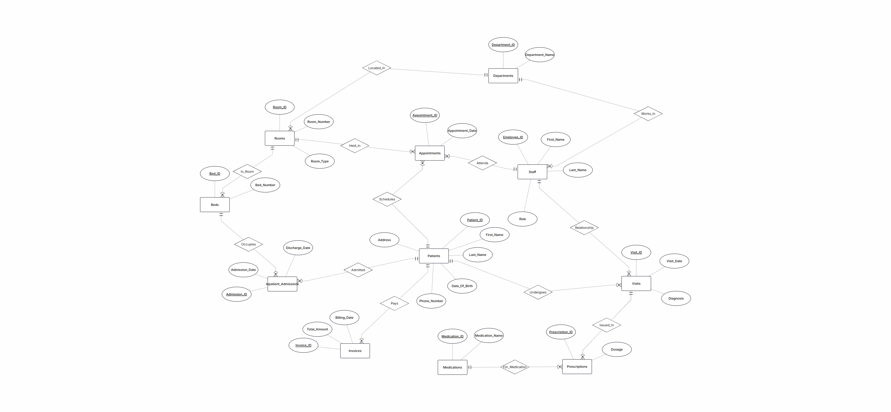

#### DSD Diagram (Physical Relational Schema)
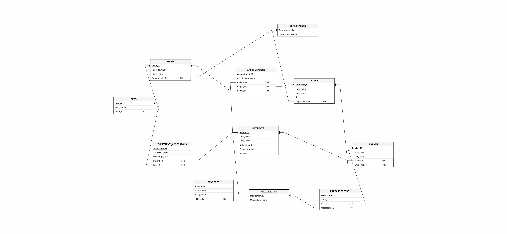

---

## Data Population Methods
We utilized three distinct methods to populate the database with over 40,000 combined records:

1. **Mockaroo (folder: `mockarooFiles`):** Used to generate data for **Patients**, **Staff**, and **Medications**.
   *Example of this method:* 
   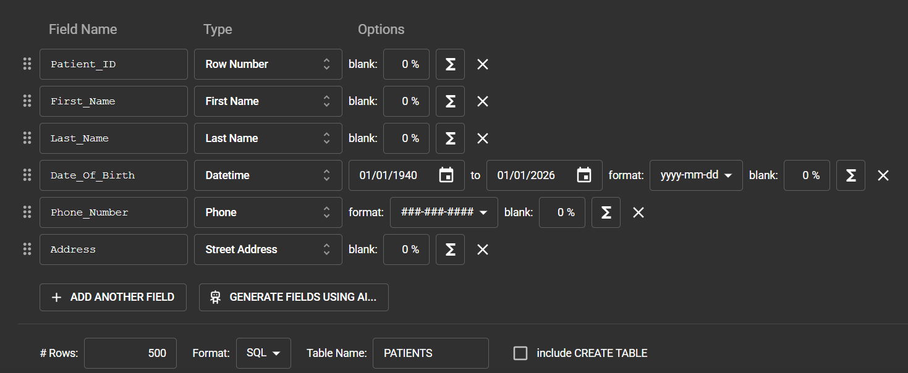

2. **Python Programming (folder: `Programming`):** A Python script was developed to generate data for **Rooms**, **Beds**, **Inpatient_Admissions**, **Visits**, **Invoices**, and **Prescriptions**.  
   *Example of this method:* 
   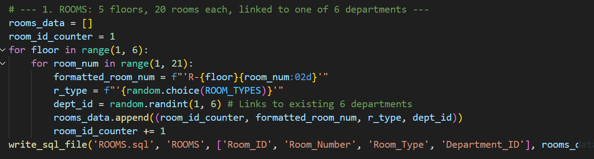

3. **Data Import via CSV (folder: `DATAIMPORTFILES`):** A Python script was developed to create data for **DEPARTMENTS** and **INPATIENT_ADMISSIONS** as a csv file which was then used to create the sql file containing the insert commands.
   *Example of this method:* 
   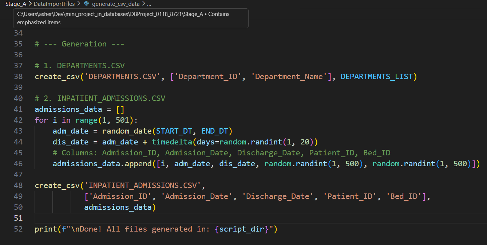
   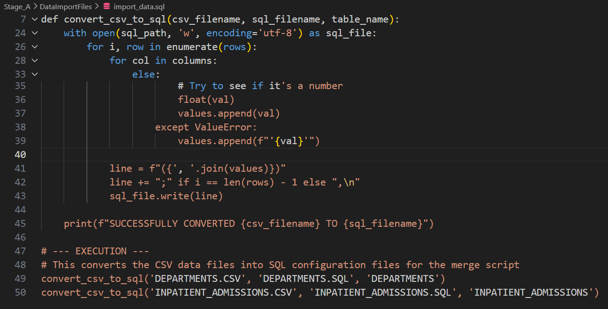

**Data Volume Statistics:**
* **Patients Table**: 20,000 records.
* **Visits Table**: 20,000 records.
* **Rooms Table**: 100 records.
* **Departments Table**: 6 records.
* **Other Tables**: 500 records.

---

## Backup and Recovery
The database was fully backed up using the pgAdmin 4 Backup tool in **Custom** format to ensure data portability and integrity.

### Backup Execution:
The backup file was saved as `backup_2026_03_18.backup`.
* **pgAdmin Backup Settings:** 
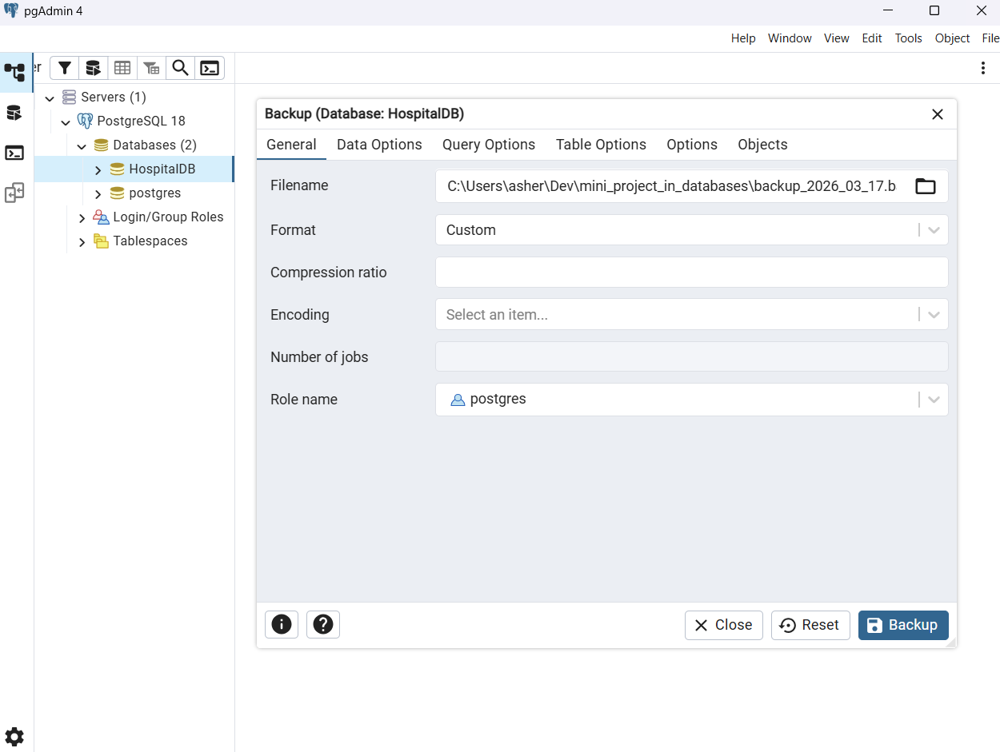
* **Backup Creation Confirmation:** 
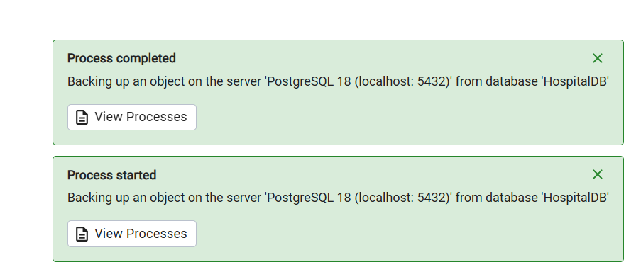

### Restore Verification:
The restoration process was successfully performed on a separate machine within a clean test environment (`Hospital_Test`) to ensure system recoverability in case of failure.
* **Restore Success Confirmation:** 
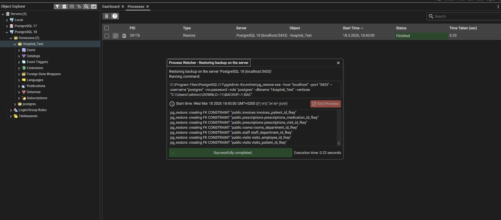
* **Post-Restore Data Validation:** A `SELECT` query was executed on the Patients table to verify the integrity of the restored data.
  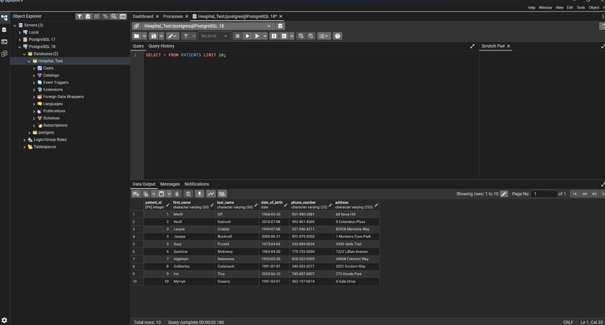

---