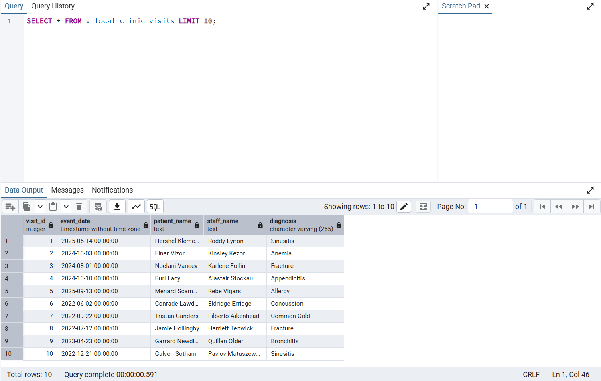
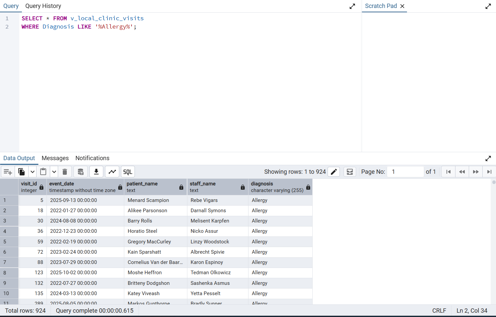
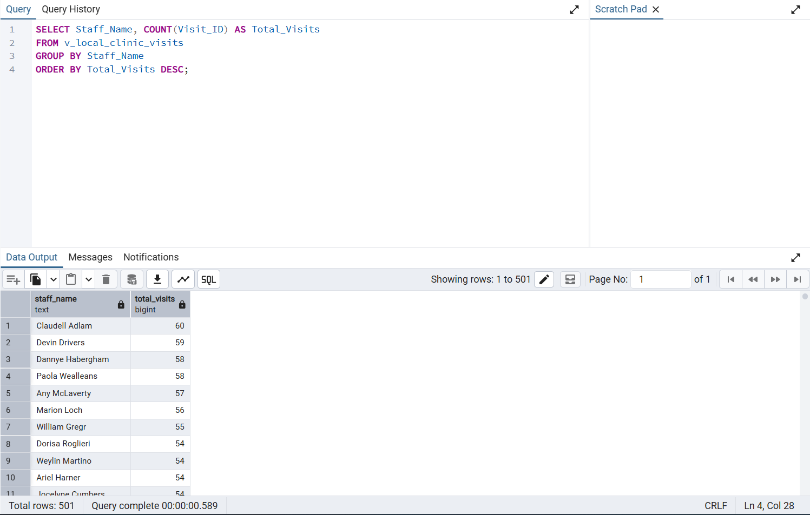
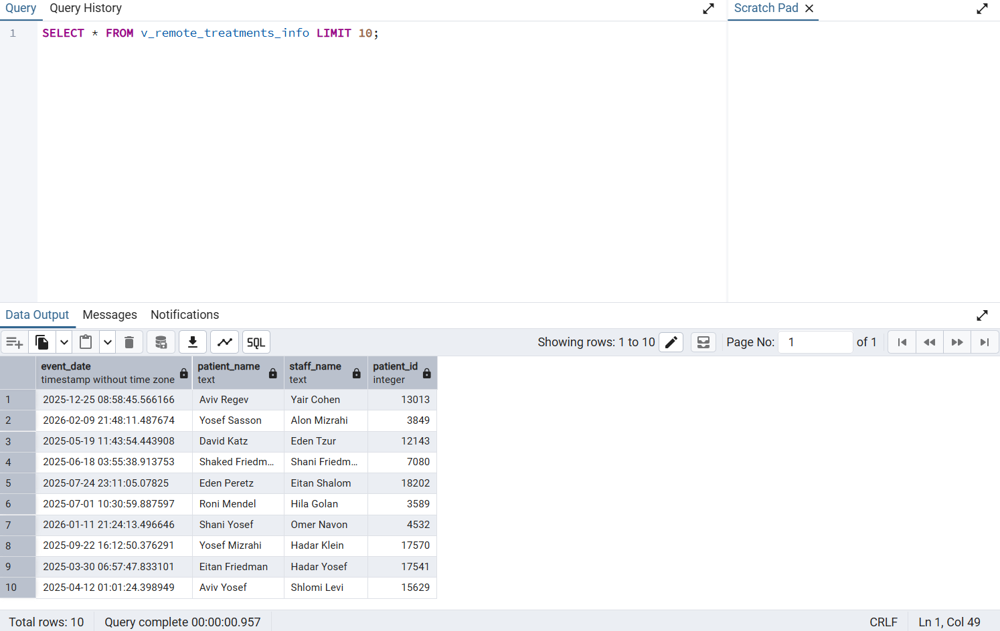
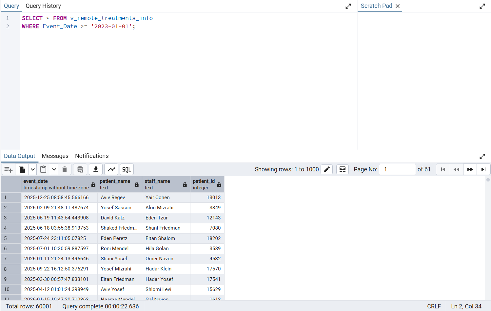
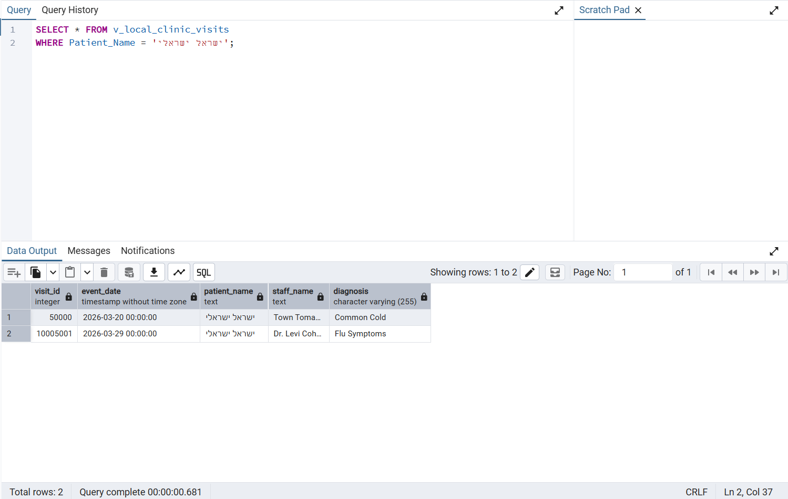
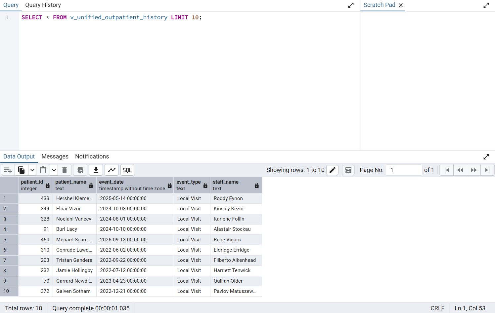
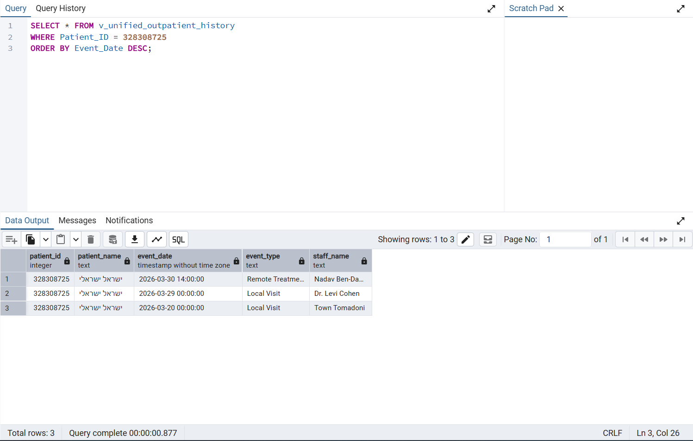
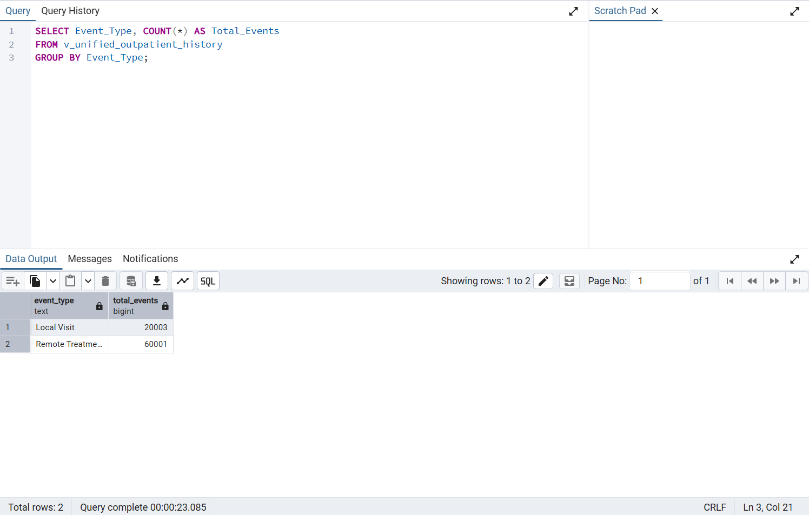

# Stage C: Database Integration and Views

**Student 1 Name:** Asher Abensour  
**Student 2 Name:** Shimon Khakshour

## Introduction
This repository contains the deliverables for Phase C of our database project. In this phase, we performed a database integration using **Method A**. We integrated our local system with a remote partner's system, merging the schemas and creating a unified perspective of the data. 

As part of the integration, we utilized the existing tables and altered our local schema to support the required integrated data without completely recreating the tables. The unified database allows us to track patient history across both our local clinic and the remote partner's facility.

## Integration Process Overview
Our main integration script (`Integrate.sql`) pulls together a unified medical timeline. We used a `UNION ALL` approach to combine three main sources of patient data into a single chronological view:
1. **Local Clinic Visits:** Joined with patient, staff, and prescription/medication tables, enriched with the `BloodType` from the partner's database.
2. **Local Inpatient Admissions:** Hospitalization records from our system, also enriched with the remote partner's blood type data.
3. **Remote Treatments:** Data pulled entirely from the partner's schema (`remote_partner`), including remote doctors, treatments, and given medications.

---

## Database Views & Queries (`Views.sql`)

As required, we created three distinct views to observe the data from our original perspective, the partner's perspective, and a fully integrated perspective. Below are the verbal descriptions, the queries executed on them, and their corresponding outputs.

### 1. Local Clinic Visits View (`v_local_clinic_visits`)
**Description:** This view represents our original department's perspective. It joins the `VISITS`, `PATIENTS`, and `STAFF` tables to provide a clear summary of all local clinic appointments, mapping IDs to actual patient and doctor names alongside the diagnosis.



#### Query 1.1: Allergy Diagnoses
**Description:** Fetches all local visits where the diagnosis explicitly includes the word 'Allergy' (Top 10 records).
```sql
SELECT * FROM v_local_clinic_visits 
WHERE Diagnosis LIKE '%Allergy%';
```


#### Query 1.2: Visits per Staff Member
**Description:** Aggregates the data to show the total number of visits handled by each staff member, ordered from highest to lowest.
```sql
SELECT Staff_Name, COUNT(Visit_ID) AS Total_Visits
FROM v_local_clinic_visits
GROUP BY Staff_Name
ORDER BY Total_Visits DESC;
```


---

### 2. Remote Partner Treatments View (`v_remote_treatments_info`)
**Description:** This view is built from the perspective of the received partner database. It extracts treatment information by joining the `remote_partner.treatment` table with the `remote_partner.person` table twice (once to resolve the patient's name, and once for the doctor's name).



#### Query 2.1: Treatments from 2023 Onwards
**Description:** Filters the remote treatment records to display only events that occurred on or after January 1st, 2023.
```sql
SELECT * FROM v_remote_treatments_info 
WHERE Event_Date >= '2023-01-01';
```


#### Query 2.2: Unique Remote Patients
**Description:** Retrieves a distinct list of all patient names who have received treatment at the partner's remote facility.
```sql
SELECT DISTINCT Patient_Name 
FROM v_remote_treatments_info;
```


---

### 3. Unified Outpatient History View (`v_unified_outpatient_history`)
**Description:** This view serves as the ultimate integration of both systems. It uses a `UNION ALL` statement to combine outpatient data from our local clinic (`VISITS`) with the remote treatments from the partner's system, creating a standardized, cross-facility timeline of events.



#### Query 3.1: Complete Patient History
**Description:** Fetches the fully integrated, chronologically descending medical history for a specific patient across both medical facilities.
```sql
SELECT * FROM v_unified_outpatient_history 
WHERE Patient_ID = 328308725
ORDER BY Event_Date DESC;
```


#### Query 3.2: Event Type Statistics
**Description:** Provides a statistical breakdown, counting the total number of medical events categorized by their origin (Local Visit vs. Remote Treatment).
```sql
SELECT Event_Type, COUNT(*) AS Total_Events
FROM v_unified_outpatient_history
GROUP BY Event_Type;
```
