# Database Project - Stage D
## PL/pgSQL Programming & Advanced Logic

**Student 1 Name:** Asher Abensour  
**Student 2 Name:** Shimon Khakshour

---

## Table of Contents
1. [Introduction](#introduction)
2. [Database Alterations](#database-alterations)
3. [Program Set 1 (Bed Management)](#program-set-1-bed-management)
4. [Program Set 2 (Patient & Billing Management)](#program-set-2-patient--billing-management)
5. [Database Triggers](#database-triggers)

---

## Introduction
This stage focuses on implementing advanced business logic directly within the database using **PL/pgSQL**. The programs written in this phase are designed to be non-trivial and incorporate a wide array of programmatic elements to ensure data integrity and automate workflows.

**Key PL/pgSQL Elements Implemented:**
* Explicit and Implicit Cursors.
* Returning `refcursor` for dynamic dataset retrieval.
* Complex DML commands (INSERT, UPDATE) modifying the database state.
* Conditional branching (`IF...THEN`) and `LOOP` structures.
* Robust `EXCEPTION` handling to catch and report errors.
* Use of `RECORD` types for iterating through data.

---

## Database Alterations
To support the new programmatic logic and triggers, several structural changes were made to the existing tables. These modifications allow for better status tracking and automated sequence generation.

**File:** `AlterTable.sql`
```sql
-- ALTER TABLE commands for Set1
ALTER TABLE INPATIENT_ADMISSIONS ALTER COLUMN Discharge_Date DROP NOT NULL;

-- ALTER TABLE commands for Set2
-- 1st command:
ALTER TABLE APPOINTMENTS ADD COLUMN Status VARCHAR(20) DEFAULT 'Scheduled';

-- 2nd command:
CREATE SEQUENCE invoices_id_seq;
ALTER TABLE INVOICES ALTER COLUMN Invoice_ID SET DEFAULT nextval('invoices_id_seq');
SELECT setval('invoices_id_seq', (SELECT COALESCE(MAX(Invoice_ID), 1) FROM INVOICES));

-- ALTER TABLE commands for Trigger1
ALTER TABLE PATIENTS ADD COLUMN Last_Updated TIMESTAMP;
```

**Execution Proofs:** 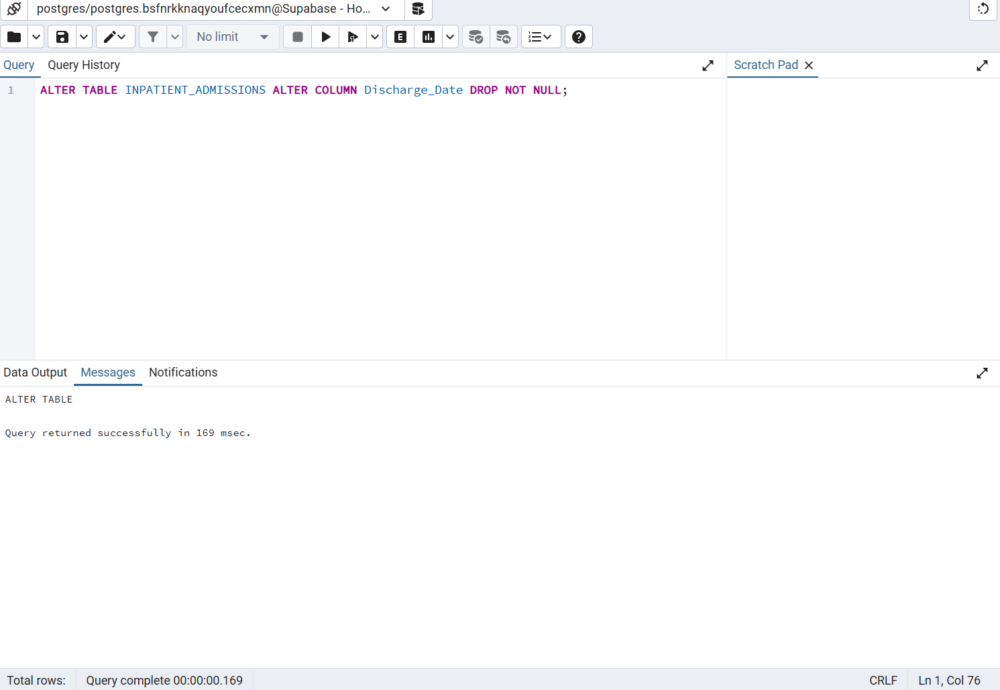  
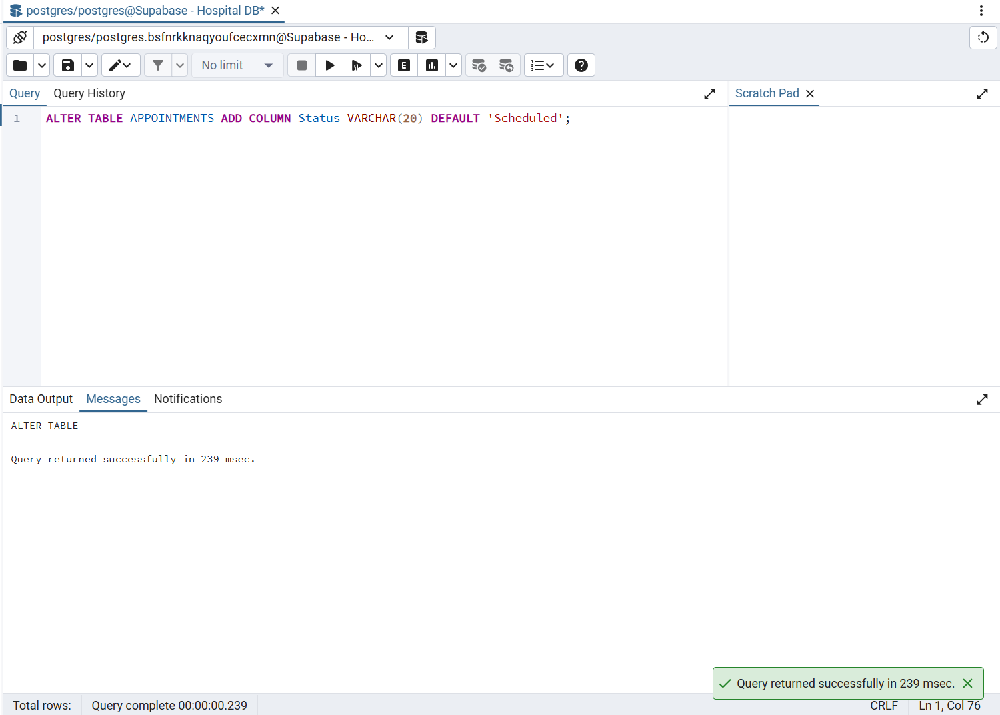  
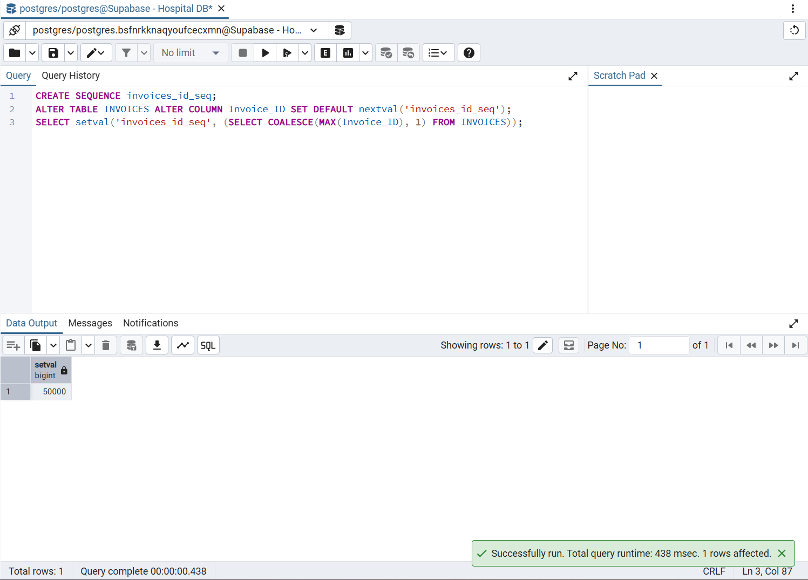  
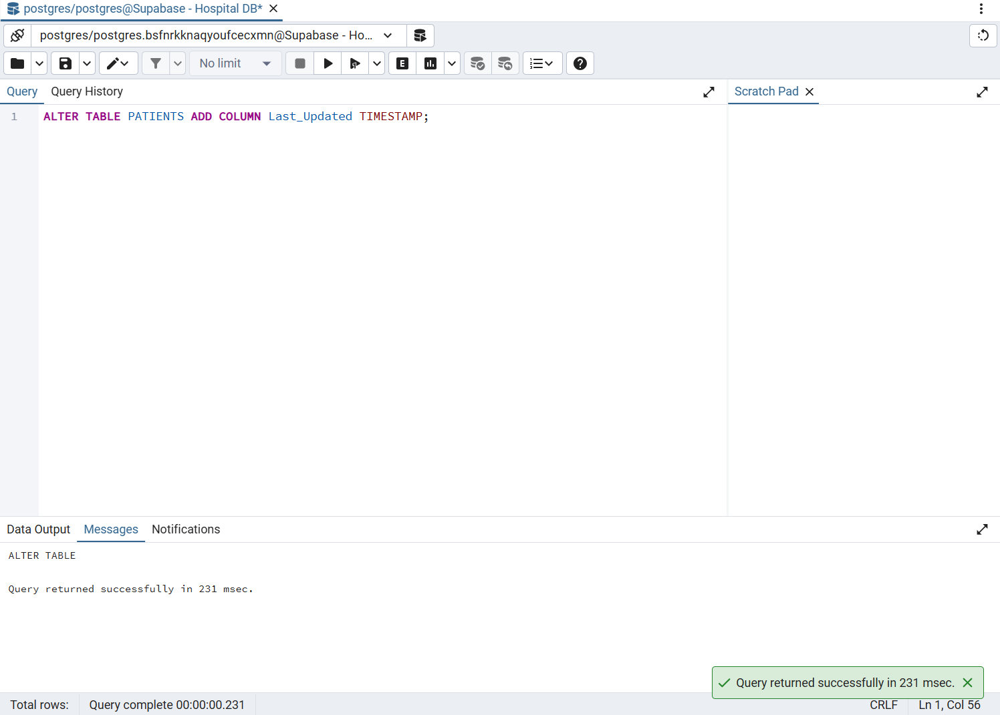  

---

## Program Set 1 (Beds Management)
This set handles the logistics of hospital beds and patient discharges, utilizing explicit cursors and DML updates.

### Function: `get_available_beds`
**Description:** Retrieves the total number of currently available (unoccupied) beds in a specific hospital department by iterating through an explicit cursor.

**Code:**
```sql
-- ==============================================================================
-- Function: get_available_beds
-- Description: Retrieves the total number of currently available (unoccupied) 
--              beds in the hospital.
-- ==============================================================================

CREATE OR REPLACE FUNCTION get_available_beds(p_dept_id INT)
RETURNS INT AS $$
DECLARE
    v_dept_exists BOOLEAN;
    v_total_beds INT := 0;
    v_occupied_beds INT := 0;
    v_bed_record RECORD;
    v_is_occupied INT;
    
    -- Explicit cursor to get all beds in the department
    c_beds CURSOR FOR 
        SELECT b.Bed_ID 
        FROM BEDS b
        JOIN ROOMS r ON b.Room_ID = r.Room_ID
        WHERE r.Department_ID = p_dept_id;
BEGIN
    -- Check if department exists
    SELECT EXISTS(SELECT 1 FROM DEPARTMENTS WHERE Department_ID = p_dept_id) INTO v_dept_exists;
    
    IF NOT v_dept_exists THEN
        RAISE EXCEPTION 'Department ID % not found.', p_dept_id;
    END IF;
    
    OPEN c_beds;
    
    -- Loop through all beds using the cursor
    LOOP
        FETCH c_beds INTO v_bed_record;
        EXIT WHEN NOT FOUND;
        
        v_total_beds := v_total_beds + 1;
        
        -- Check if current bed is occupied (Discharge_Date is null or in future)
        SELECT COUNT(*) INTO v_is_occupied
        FROM INPATIENT_ADMISSIONS
        WHERE Bed_ID = v_bed_record.Bed_ID 
          AND (Discharge_Date IS NULL OR Discharge_Date > CURRENT_DATE);
          
        IF v_is_occupied > 0 THEN
            v_occupied_beds := v_occupied_beds + 1;
        END IF;
    END LOOP;
    
    CLOSE c_beds;
    
    -- Return available beds
    RETURN v_total_beds - v_occupied_beds;
    
EXCEPTION
    WHEN OTHERS THEN
        RAISE NOTICE 'An error occurred: %', SQLERRM;
        RETURN -1;
END;
$$ LANGUAGE plpgsql;
```
**Creation Proof:** 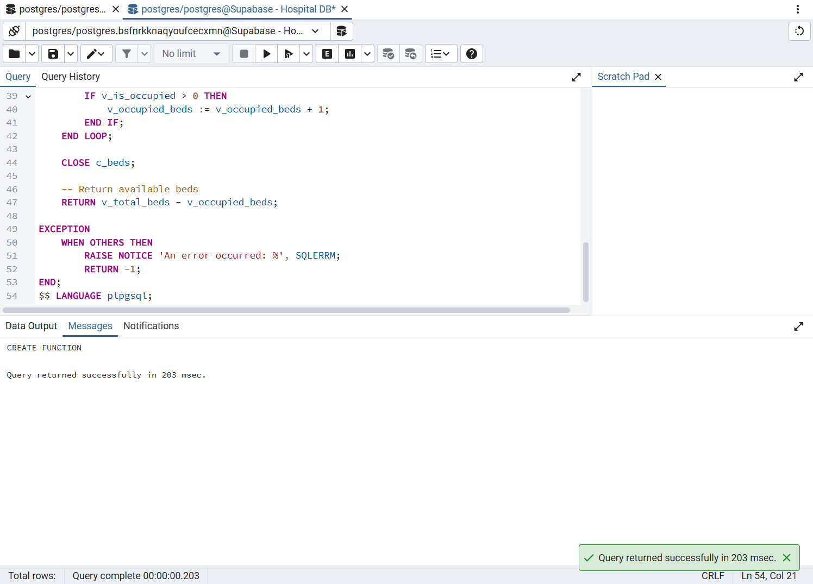

### Procedure: `discharge_patient`
**Description:** Discharges an inpatient by validating their admission record via an implicit cursor and executing a DML `UPDATE` to set their discharge date to the current date.

**Code:**
```sql
-- ==============================================================================
-- Procedure: discharge_patient
-- Description: Discharges an inpatient by setting their discharge date and 
--              updating the associated bed status to 'Available'.
-- ==============================================================================

CREATE OR REPLACE PROCEDURE discharge_patient(p_admission_id INT)
LANGUAGE plpgsql AS $$
DECLARE
    v_exists INT;
BEGIN
    -- Implicit cursor to check if the admission exists
    SELECT 1 INTO v_exists 
    FROM INPATIENT_ADMISSIONS 
    WHERE Admission_ID = p_admission_id;
    
    IF NOT FOUND THEN
        RAISE EXCEPTION 'Admission ID % does not exist.', p_admission_id;
    END IF;

    -- DML Command: Update discharge date to today
    UPDATE INPATIENT_ADMISSIONS
    SET Discharge_Date = CURRENT_DATE
    WHERE Admission_ID = p_admission_id;
    
END;
$$;
```
**Creation Proof:** 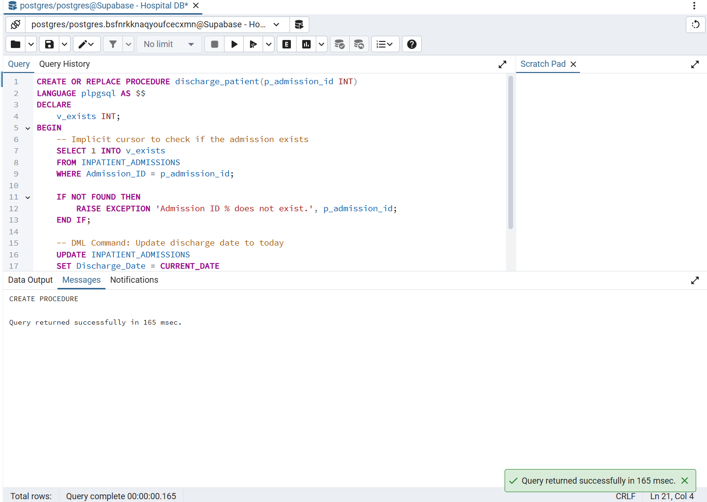

### Main Program 1
**Description:** An anonymous DO block that executes the `discharge_patient` procedure and verifies the updated count of available beds using the `get_available_beds` function.

**Code:**
```sql
-- ==============================================================================
-- Main Program: Set 1
-- Description: An anonymous DO block that executes the discharge_patient 
--              procedure and verifies the updated count of available beds.
-- ==============================================================================

DO $$
DECLARE
    v_dept_id INT := 1;
    v_admission_id INT := 999;
    v_beds_before INT;
    v_beds_after INT;
BEGIN
    -- 1. Call the function before DML
    v_beds_before := get_available_beds(v_dept_id);
    RAISE NOTICE 'BEFORE: Department % has % available beds.', v_dept_id, v_beds_before;
    
    -- 2. Call the procedure to discharge a patient (DML UPDATE)
    CALL discharge_patient(v_admission_id);
    RAISE NOTICE 'ACTION: Patient from admission % discharged.', v_admission_id;
    
    -- 3. Call the function after DML to prove it worked
    v_beds_after := get_available_beds(v_dept_id);
    RAISE NOTICE 'AFTER: Department % now has % available beds.', v_dept_id, v_beds_after;
    
EXCEPTION
    WHEN OTHERS THEN
        RAISE NOTICE 'An error occurred during the process: %', SQLERRM;
END;
$$;
```
**Execution Proof:** 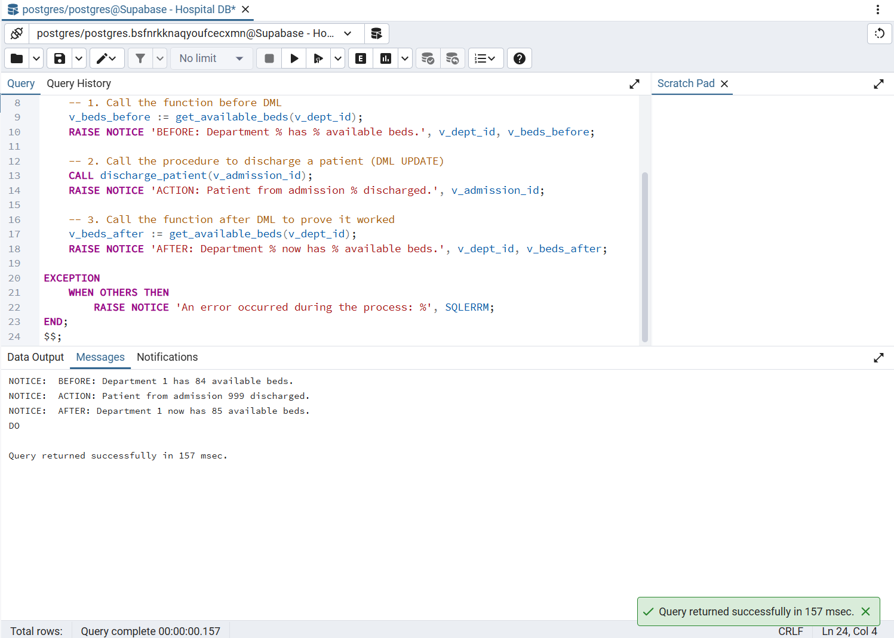  
**Proof For Database Change:** 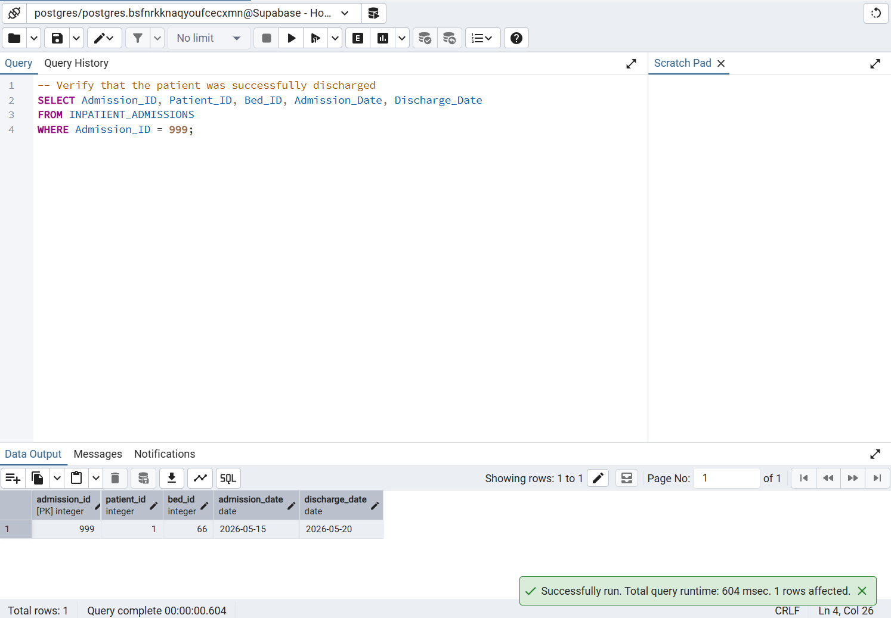

---

## Program Set 2 (Patient & Billing Management)
This set manages appointments, automatic invoice generation, and retrieving dynamic medical histories using Ref Cursors.

### Function: `get_patient_history`
**Description:** Validates a patient's existence and returns a dynamic `refcursor` containing their complete medical visit history and diagnoses.

**Code:**
```sql
-- ==============================================================================
-- Function: get_patient_history
-- Description: Returns a Ref Cursor containing the complete medical visit 
--              history and diagnoses for a specific patient.
-- ==============================================================================

CREATE OR REPLACE FUNCTION get_patient_history(p_patient_id INT)
RETURNS refcursor AS $$
DECLARE
    v_ref_cursor refcursor;
    v_exists BOOLEAN;
BEGIN
    -- Check if patient exists
    SELECT EXISTS(SELECT 1 FROM PATIENTS WHERE Patient_ID = p_patient_id) INTO v_exists;
    
    IF NOT v_exists THEN
        RAISE EXCEPTION 'Patient ID % not found.', p_patient_id;
    END IF;

    -- Open the ref cursor for the patient's visits
    OPEN v_ref_cursor FOR
        SELECT Visit_ID, Visit_Date, Diagnosis
        FROM VISITS
        WHERE Patient_ID = p_patient_id
        ORDER BY Visit_Date DESC;

    -- Return the cursor itself
    RETURN v_ref_cursor;
END;
$$ LANGUAGE plpgsql;
```
**Creation Proof:** 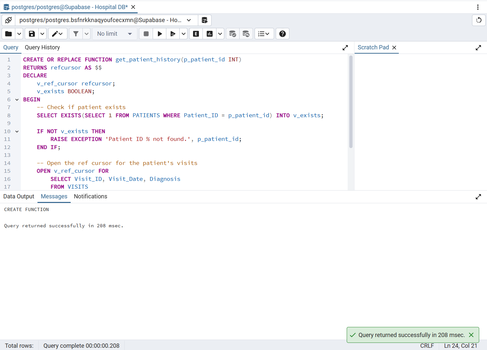

### Procedure: `complete_appointment`
**Description:** Marks an appointment status as 'Completed' and automatically generates a new billing invoice. It relies on the newly established auto-increment sequence for the Invoice ID.

**Code:**
```sql
-- ==============================================================================
-- Procedure: complete_appointment
-- Description: Marks an appointment status as 'Completed' and automatically 
--              generates a new billing invoice using the auto-increment sequence.
-- ==============================================================================

CREATE OR REPLACE PROCEDURE complete_appointment(p_appointment_id INT, p_patient_id INT, p_cost DECIMAL)
LANGUAGE plpgsql AS $$
BEGIN
    -- DML Command 1: Update appointment status
    UPDATE APPOINTMENTS
    SET Status = 'Completed'
    WHERE Appointment_ID = p_appointment_id;

    -- DML Command 2: Insert a new invoice for this patient
    INSERT INTO INVOICES (Total_Amount, Billing_Date, Patient_ID)
    VALUES (p_cost, CURRENT_DATE, p_patient_id);
    
EXCEPTION
    WHEN OTHERS THEN
        RAISE NOTICE 'An error occurred during appointment completion: %', SQLERRM;
END;
$$;
```
**Creation Proof:** 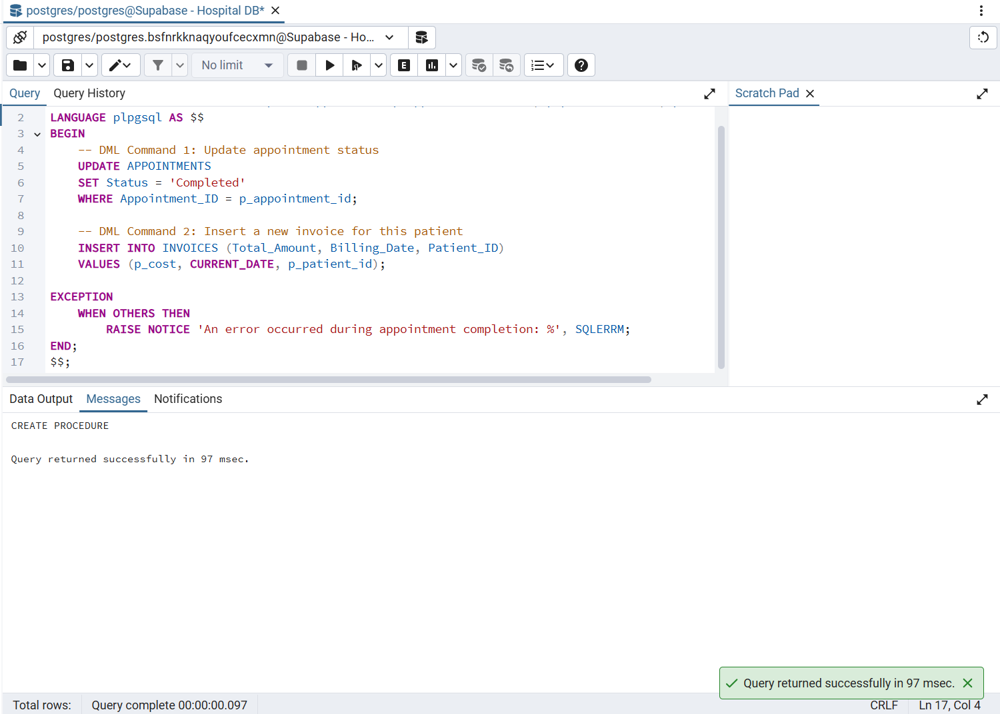

### Main Program 2
**Description:** An anonymous DO block that completes an appointment, generates an invoice, and successfully loops through the fetched `refcursor` to print the patient's medical history.

**Code:**
```sql
-- ==============================================================================
-- Main Program: Set 2
-- Description: An anonymous DO block that completes an appointment, generates 
--              an invoice, and iterates over the patient's history Ref Cursor.
-- ==============================================================================

DO $$
DECLARE
    v_patient_id INT := 60;
    v_appointment_id INT := 1;
    v_visit_history refcursor;
    v_visit_record RECORD;
BEGIN
    -- 1. Call Procedure (Executes multiple DMLs: UPDATE and INSERT)
    CALL complete_appointment(v_appointment_id, v_patient_id, 150.0);
    RAISE NOTICE 'ACTION: Appointment % completed and invoice generated.', v_appointment_id;

    -- 2. Call Function (Returns Ref Cursor)
    v_visit_history := get_patient_history(v_patient_id);

    -- 3. Loop through the returned ref cursor and print
    RAISE NOTICE '--- Patient % Visit History ---', v_patient_id;
    LOOP
        FETCH v_visit_history INTO v_visit_record;
        EXIT WHEN NOT FOUND;
        
        RAISE NOTICE 'Visit ID: %, Date: %, Diagnosis: %', 
            v_visit_record.Visit_ID, v_visit_record.Visit_Date, v_visit_record.Diagnosis;
    END LOOP;

    -- Close the cursor when done
    CLOSE v_visit_history;
    
EXCEPTION
    WHEN OTHERS THEN
        RAISE NOTICE 'An error occurred in the main program: %', SQLERRM;
END;
$$;
```
**Execution Proof:** 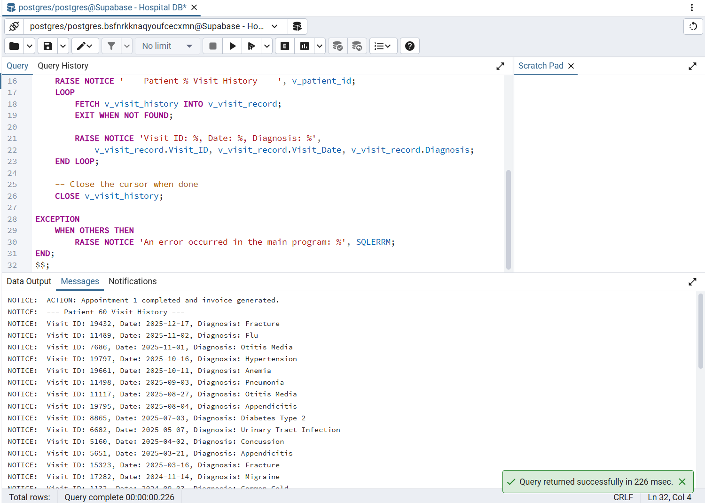  
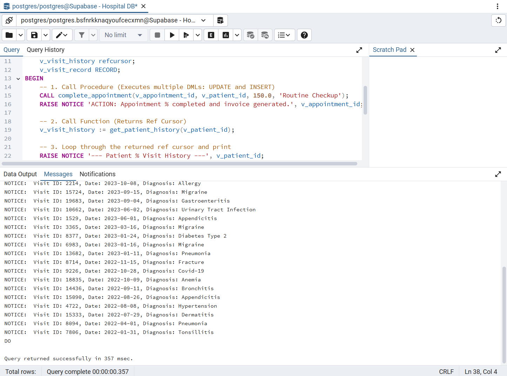  
**Proof For Database Change:** 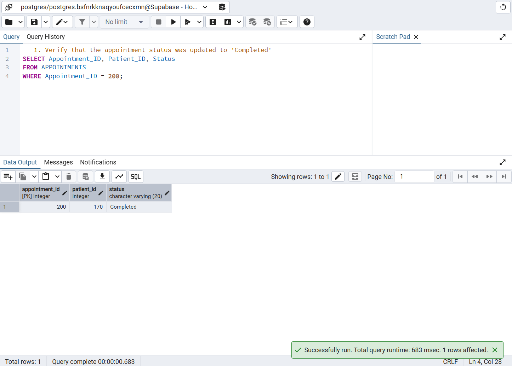  


---

## Database Triggers
Triggers were implemented to enforce complex business rules and automate tracking mechanisms that standard constraints cannot handle.

### Trigger 1: Patient Record Update Tracking (UPDATE)
**Description:** An active observer function that automatically injects the exact current system timestamp into the `Last_Updated` column whenever a patient's record is modified via an `UPDATE` command.

**Code:**
```sql
-- ==============================================================================
-- Trigger1
-- Trigger & Observer Function: trg_patient_update / set_last_updated
-- Description: Automatically injects the exact current timestamp into the 
--              Last_Updated column whenever a patient's record is modified.
-- ==============================================================================

-- The observer function to automatically update the timestamp
CREATE OR REPLACE FUNCTION set_last_updated()
RETURNS TRIGGER AS $$
BEGIN
    -- Inject the current exact time into the row before it saves
    NEW.Last_Updated := CURRENT_TIMESTAMP;
    RETURN NEW;
END;
$$ LANGUAGE plpgsql;

-- Trigger definition executing before UPDATE on PATIENTS
CREATE TRIGGER trg_patient_update
BEFORE UPDATE ON PATIENTS
FOR EACH ROW
EXECUTE FUNCTION set_last_updated();
```
**Creation Proof:** 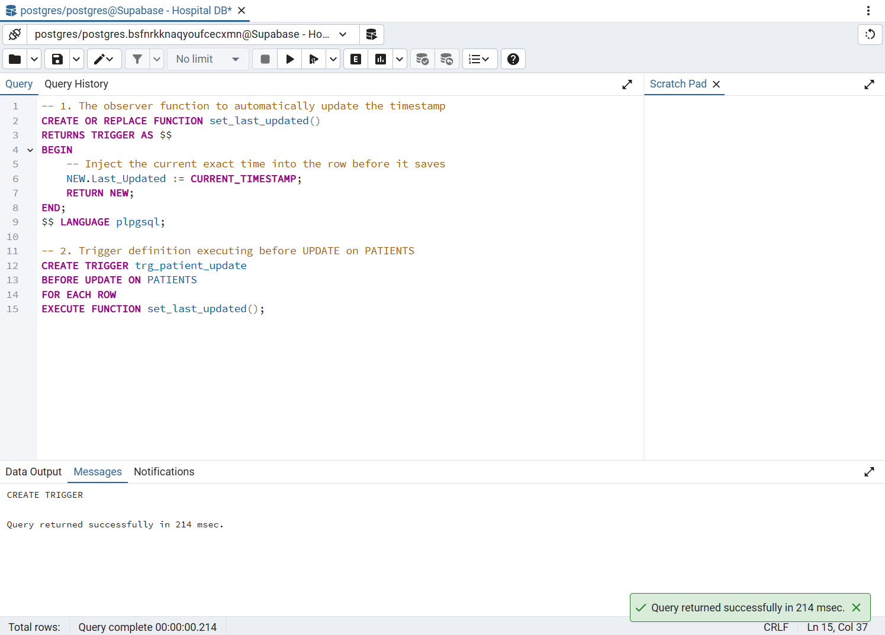  
**Testing Proof (Timestamp updated successfully):** 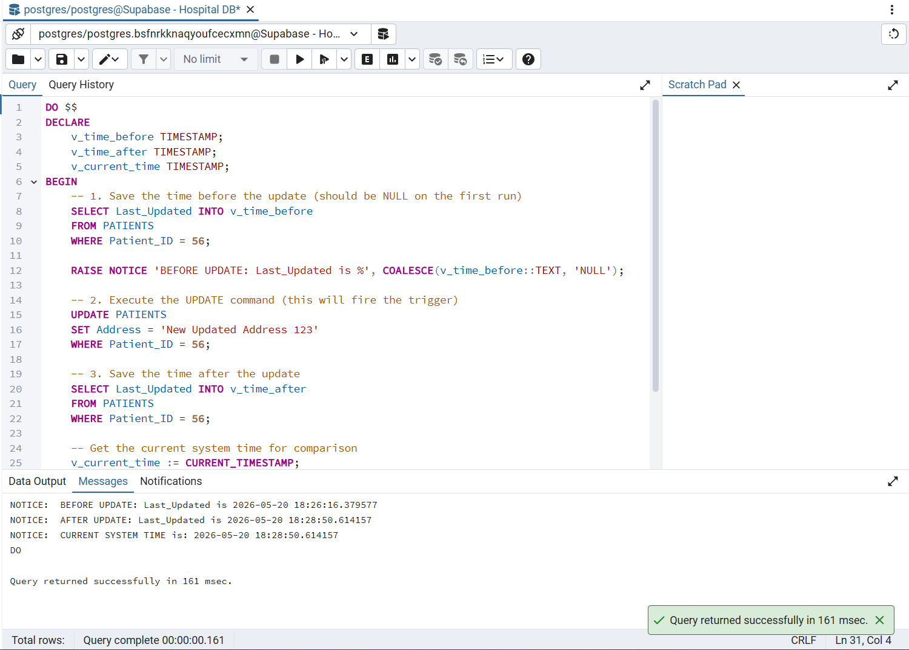

### Trigger 2: Appointment Date Validation (INSERT)
**Description:** Validates new appointments prior to insertion, raising an explicit `EXCEPTION` if the user attempts to schedule an appointment with a date in the past.

**Code:**
```sql
-- ==============================================================================
-- Trigger2
-- Trigger & Observer Function: trg_validate_appointment / validate_appointment_date
-- Description: Validates new appointments prior to insertion, raising an 
--              exception if the scheduled date is in the past.
-- ==============================================================================

-- The observer function to validate appointment scheduling dates
CREATE OR REPLACE FUNCTION validate_appointment_date()
RETURNS TRIGGER AS $$
BEGIN
    -- Prevent scheduling an appointment in the past using dynamic CURRENT_DATE
    IF NEW.Appointment_Date < CURRENT_DATE THEN
        RAISE EXCEPTION 'Validation Failed: Cannot schedule an appointment in the past (Date: %).', NEW.Appointment_Date;
    END IF;
    RETURN NEW;
END;
$$ LANGUAGE plpgsql;

-- Trigger definition executing before INSERT on APPOINTMENTS
CREATE TRIGGER trg_validate_appointment
BEFORE INSERT ON APPOINTMENTS
FOR EACH ROW
EXECUTE FUNCTION validate_appointment_date();
```
**Creation Proof:** 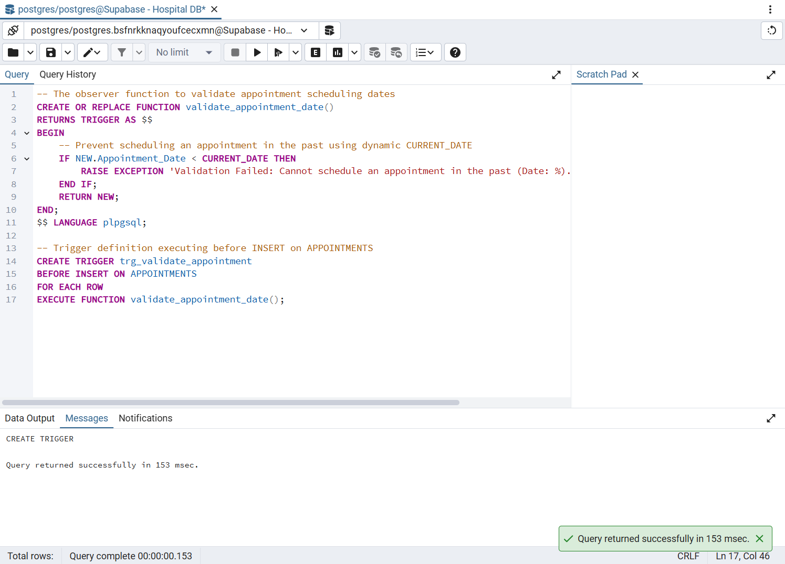  
**Testing Proof (Exception caught):** 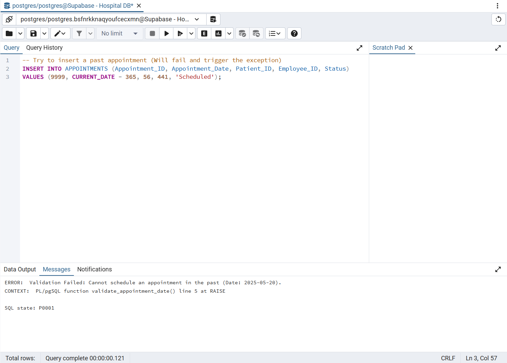

---