# Hospital Management System - Stage E (GUI)

---

## 1. Tools & Workflow
* **Language & UI Framework:** Python 3.10+ using the `customtkinter` library to build a modern, responsive Graphical User Interface.
* **Database & Driver:** Cloud-hosted PostgreSQL via **Supabase**, utilizing the `psycopg2` driver for secure, direct database communication.
* **Workflow Architecture:**
  - **CRUD Operations:** Designed full insert, read, update, and delete screens across all 11 tables using a unified auto-increment ID generation policy.
  - **Data Integration (Foreign Keys):** Implemented relational SQL `JOIN` statements across all views to display descriptive names (e.g., patient names, department names, room numbers) instead of raw numeric IDs.
  - **Advanced Components Integration:** Embedded direct operational hooks to trigger complex analytical queries from Stage B, alongside the execution of transactions, stored procedures, and scalar functions from Stage D.

---

## 2. How to Run the Application

### Prerequisites
1. Install the required Python libraries:

  ```bash
   pip install -r requirements.txt
  ```

2. Ensure your .env file is present in the root directory with valid Supabase credentials:
  ```bash
   DB_HOST=
   DB_NAME=
   DB_USER=
   DB_PASSWORD=
   DB_PORT=
   ```

### Execution
Run the following command from the terminal inside the Stage_E directory:
```bash
python src/main.py
```

---

## 3. Application Screenshots

### System Screens

#### Welcome Gate Screen
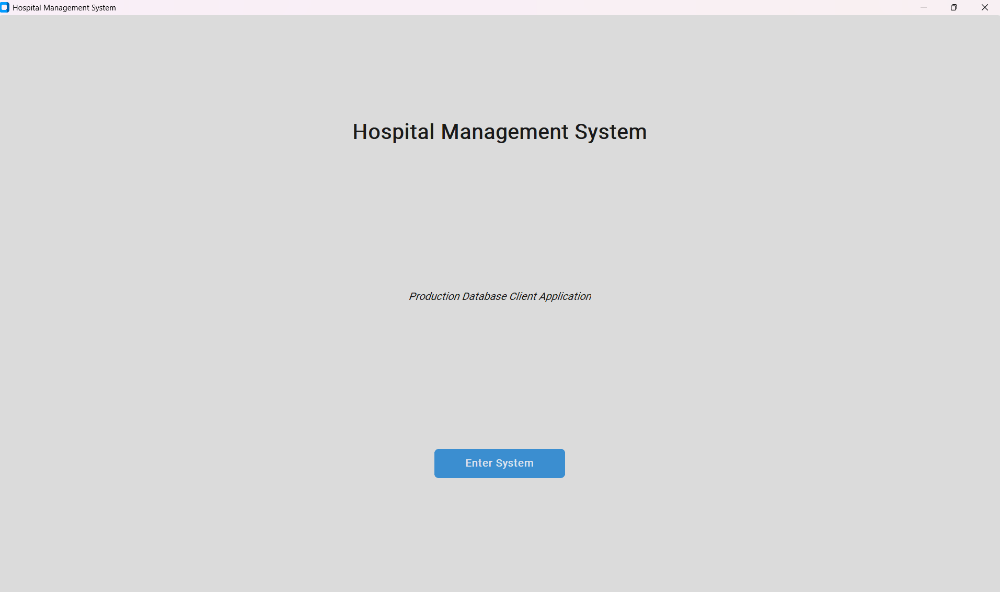

#### Patient Management Screen
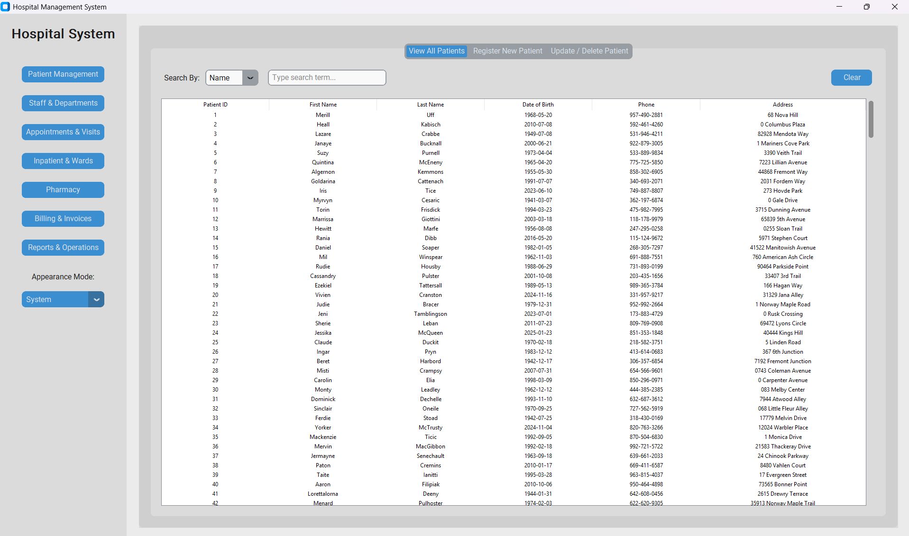

#### Staff & Departments Screen
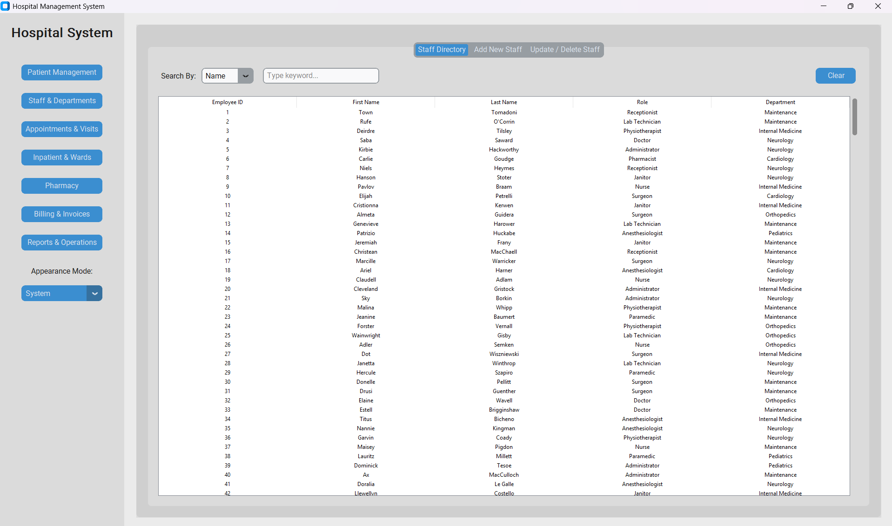

#### Appointments & Visits Screen
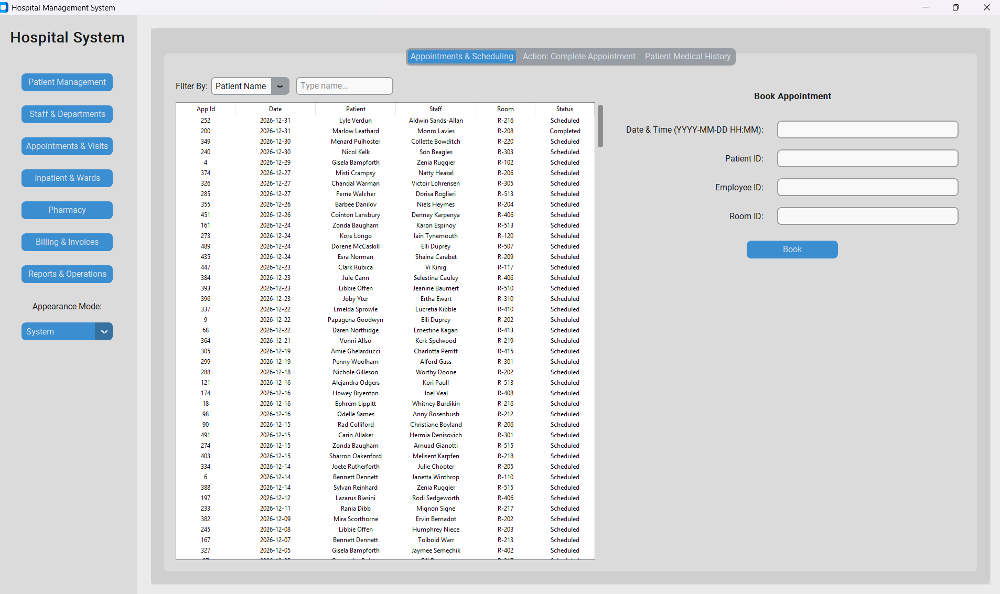

#### Inpatient & Wards Screen
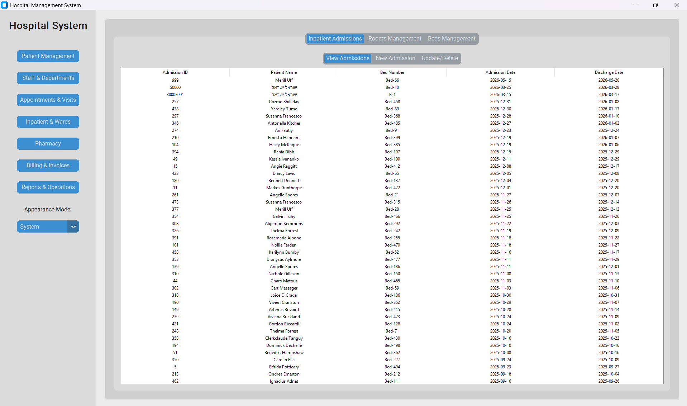

#### Pharmacy Screen
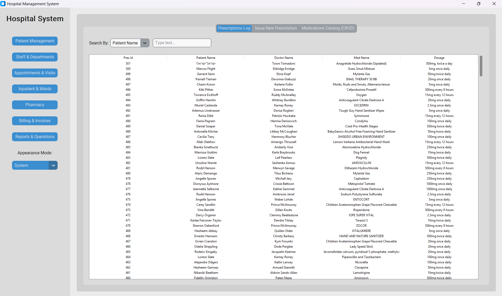

#### Billing & Invoices Screen
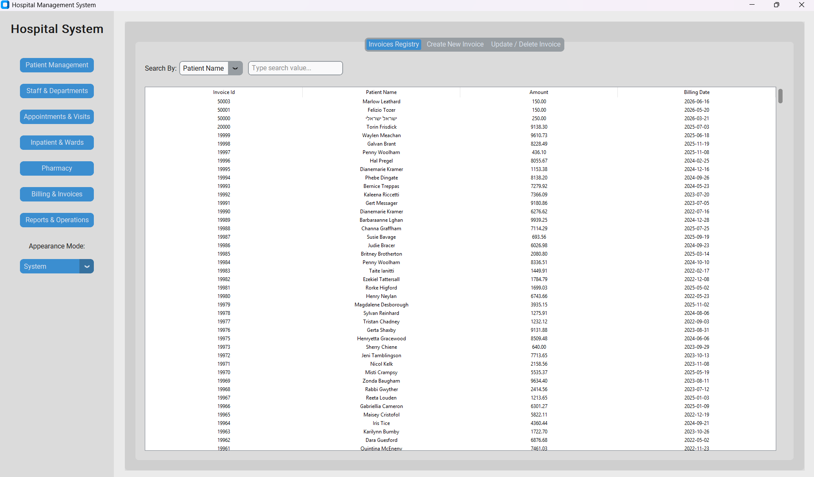

#### Reports & Operations Screen
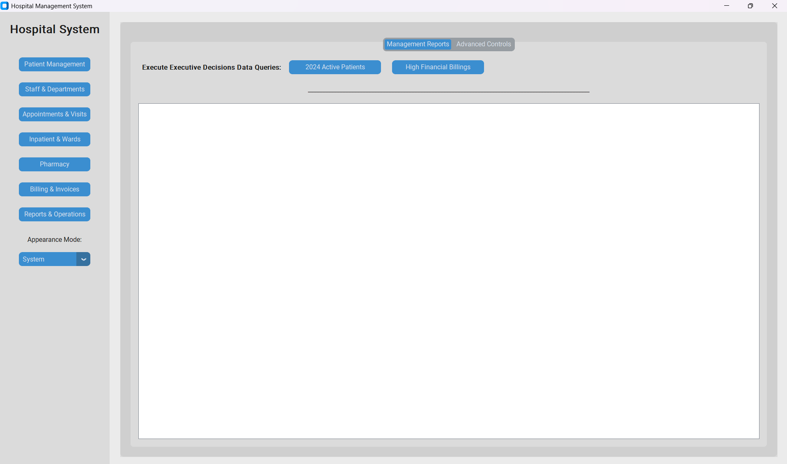

---

### Database Operations In The Reports & Operations Screen

#### Stage B Query 1 (2024 Active Patients)
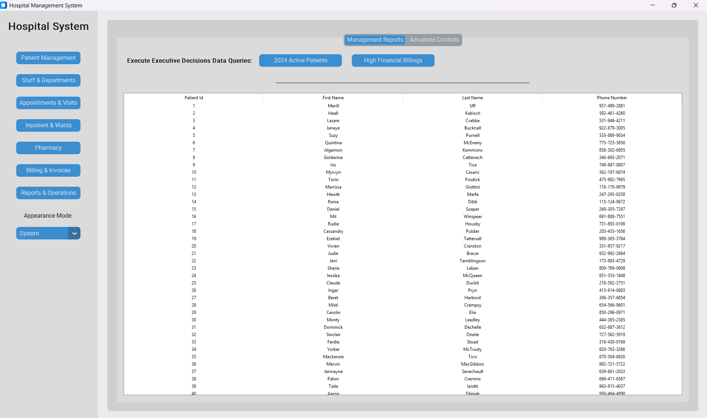

#### Stage B Query 5 (High Financial Billings)
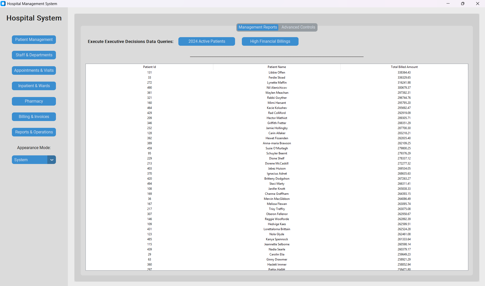

#### Stage D Function (Calculate Available Beds)
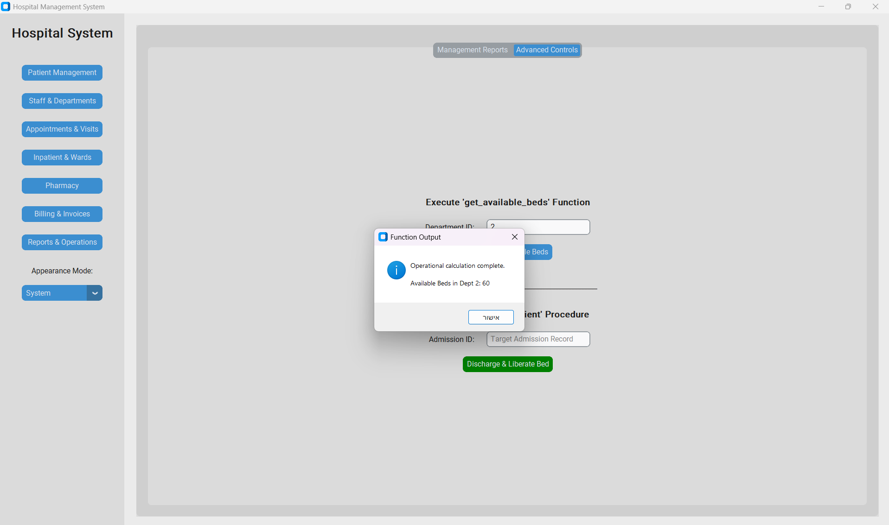

#### Stage D Procedure (Discharge & Liberate Bed)
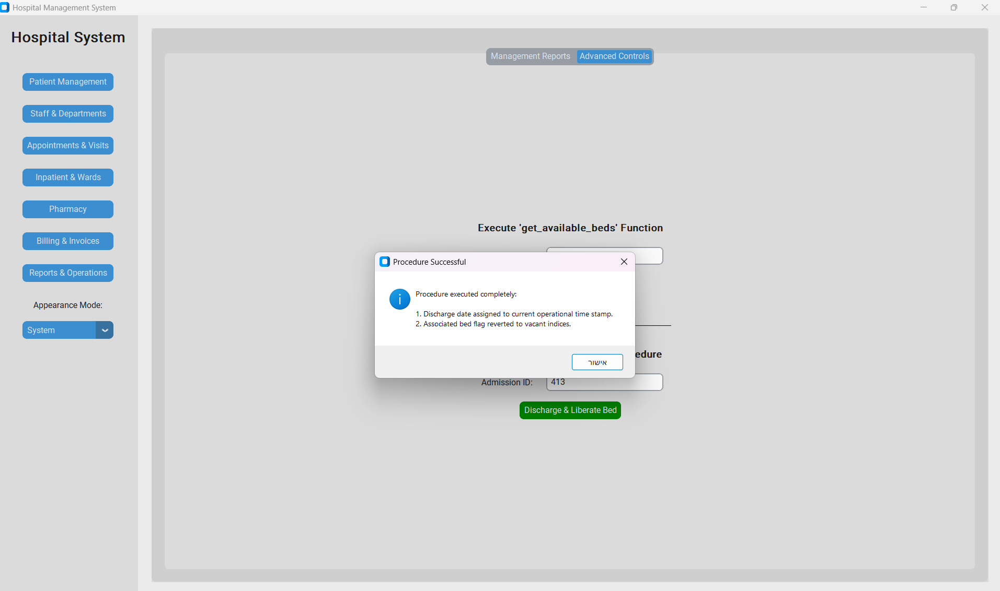