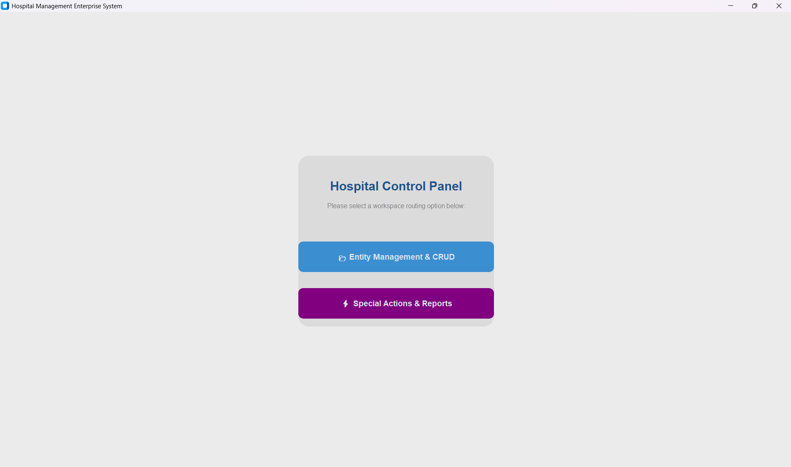
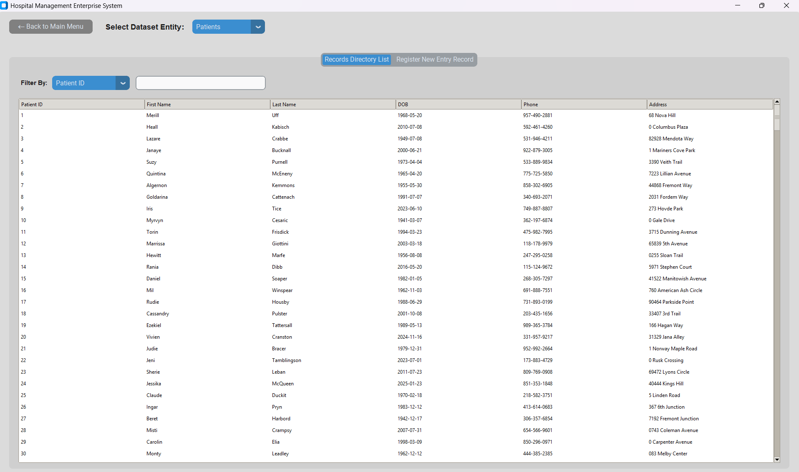
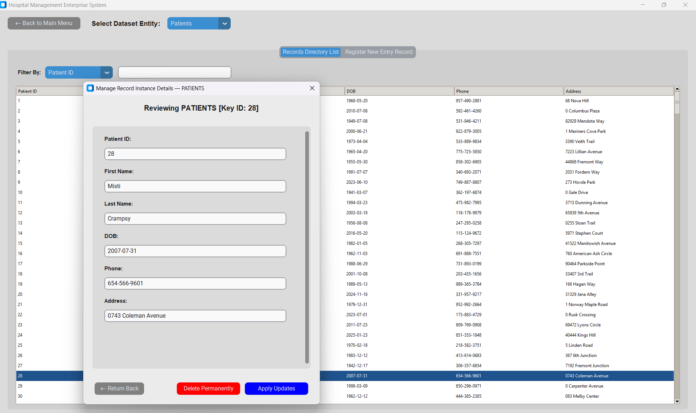
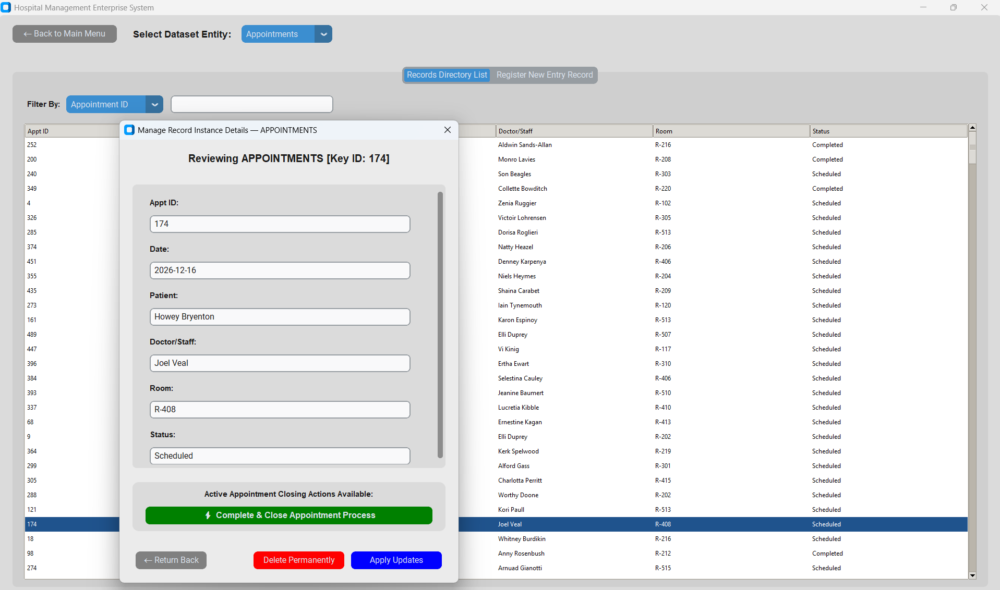
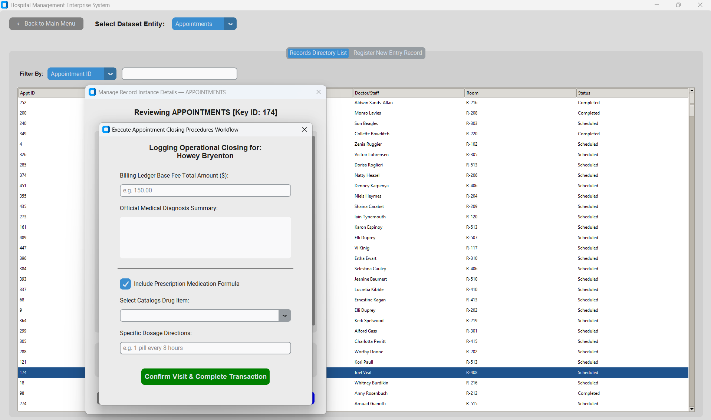
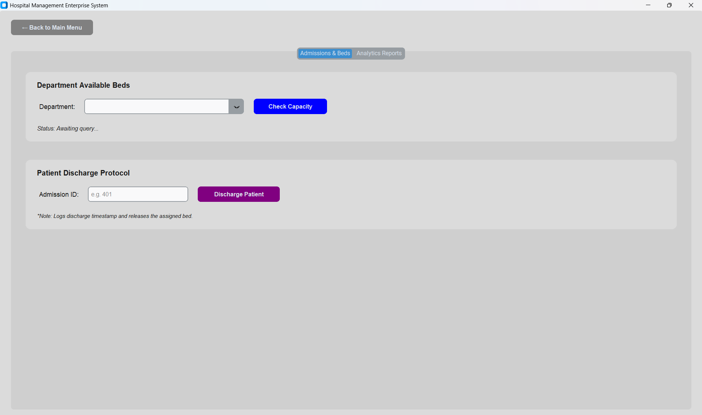
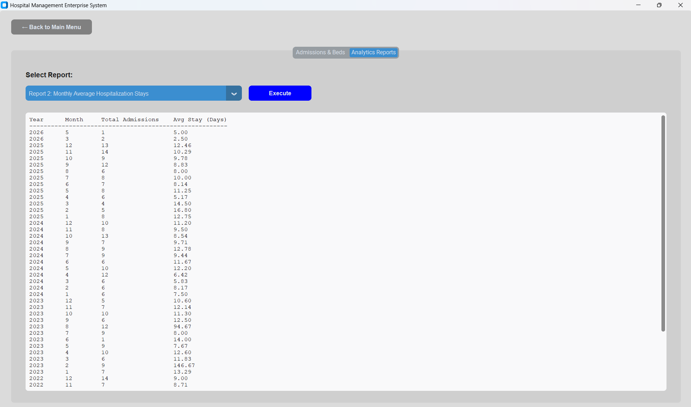

# Hospital Management System - Stage E (GUI)

---

## 1. Tools & Workflow
* **Language & UI Framework:** Python 3.10+ using the `customtkinter` library to build a modern, high-contrast, and responsive Graphical User Interface.
* **Database & Driver:** Cloud-hosted PostgreSQL via **Supabase**, utilizing the `psycopg2` driver for secure, direct database communication.
* **Workflow Architecture:**
  - **Direct Menu Access:** Eliminated unnecessary welcome gateways to boot the application directly into a clean, 2-button structural routing panel.
  - **Dynamic Metadata CRUD:** Engineered generic insert, read, update, and delete workspaces across all 11 tables powered by dynamic data dictionary configurations.
  - **Advanced Textual Joins:** Resolved raw numeric foreign keys automatically using relational SQL `JOIN` subqueries to fetch and display human-readable descriptive text in popups.
  - **Targeted Filter Engine:** Replaced loose global string scanning with dedicated dropdown search filters, forcing strict absolute matching (`==`) for database identifier keys (IDs).
  - **Structured Input Splitters:** Bypassed slow calendar widgets by rendering separate typographic text fields for Day (DD), Month (MM), Year (YYYY), and Time (HH:MM) which automatically compile into standard database timestamps.
  - **Separation of Concerns:** Encapsulated all stored procedures, relational functions, and heavy analytic aggregations cleanly inside the `DatabaseManager` layer to decouple the UI from raw SQL execution.

---

## 2. How to Run the Application

### Prerequisites
1. Install the required Python libraries:

    ```bash
    pip install -r requirements.txt
    ```

2. Ensure your .env file is present in the root directory with valid Supabase credentials:

    ```bash
    DB_HOST=
    DB_NAME=
    DB_USER=
    DB_PASSWORD=
    DB_PORT=
    ```

### Execution

Run the following command from the terminal inside the Stage_E directory:

```bash
python src/main.py
```

---

## 3. Application Screenshots

#### 1. Main Menu Hub Screen


#### 2. Patients Directory Workspace Screen (CRUD)


#### 3. Patient Record Instance Detail Popup


#### 4. Scheduled Appointment Detail Popup


#### 5. Appointment Completion Popup


#### 6. Special Operations Screeb Tab 1 (Discharge & Bed Count)


#### 7. Special Operations Screeb Tab 2 (Analytics Reports)
